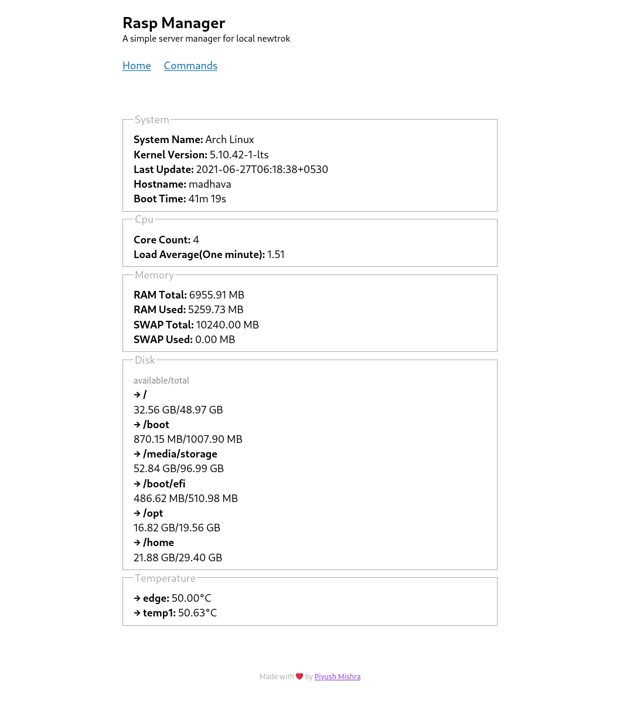

# Rasp Manager
A simple server manager for local network. Its quite helpful when you are hosting something on Raspberry Pi.

Change `static_dir` to where static files exist add more commands in `Config.toml`. Contributions and improvements are always welcomed.

Edit systemd service `rasp_mgr.service` as per your need and place it in `/usr/lib/systemd/system/` and enable it.

# LICENSE
This program is free software: you can redistribute it and/or modify
it under the terms of the GNU General Public License as published by
the Free Software Foundation, either version 3 of the License, or
at your option) any later version.

This program is distributed in the hope that it will be useful,
but WITHOUT ANY WARRANTY; without even the implied warranty of
MERCHANTABILITY or FITNESS FOR A PARTICULAR PURPOSE.  See the
GNU General Public License for more details.

You should have received a copy of the GNU General Public License
along with this program.  If not, see <https://www.gnu.org/licenses/>.
